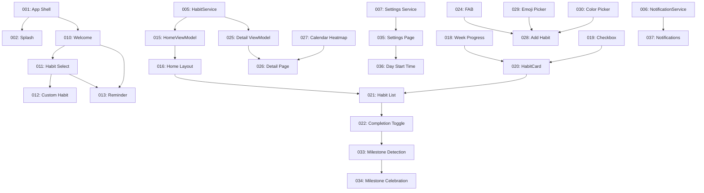

# Stribe Implementation Commands
## Complete Command-Based Development Plan

Dette dokument indeholder den komplette liste af implementation commands for Stribe habit tracker app.

---

## Command System Overview

Hvert command repræsenterer en selvstændig, testbar implementation task der kan udføres sekventielt eller individuelt.

### Command Format
- **ID**: Unikt 3-cifret nummer
- **Fase**: 1-5 (Foundation → Polish)
- **Estimat**: Tid i timer
- **Afhængigheder**: Hvilke commands skal være færdige først
- **Design Reference**: Link til design spec

---

## Phase Overview

| Fase | Navn | Commands | Estimeret Tid | Status |
|------|------|----------|---------------|--------|
| 1 | Foundation | 001-009 | 16-20 timer | ⏸️ Not started |
| 2 | Onboarding | 010-014 | 12-16 timer | ⏸️ Not started |
| 3 | Core Experience | 015-024 | 24-30 timer | ⏸️ Not started |
| 4 | Management | 025-032 | 16-20 timer | ⏸️ Not started |
| 5 | Polish & Launch | 033-042 | 20-25 timer | ⏸️ Not started |
| **TOTAL** | - | **42 commands** | **88-111 timer** | - |

---

## PHASE 1: FOUNDATION (001-009)
*Fundamentale komponenter og setup*

### 001 - App Shell & Navigation ✅ Command exists
- **Tid**: 2-3 timer
- **Afhængigheder**: None
- **Design**: NAVIGATION.md
- **Beskrivelse**: Opret AppShell med route registreringer for alle skærme
- **Output**: AppShell.xaml, routing logic i App.xaml.cs

### 002 - Splash Screen
- **Tid**: 1-2 timer
- **Afhængigheder**: 001
- **Design**: screens/01_SPLASH.md
- **Beskrivelse**: Simpel splash screen med logo og fade animation
- **Output**: SplashPage.xaml, 1.5s delay navigation

### 003 - Helpers & Extensions
- **Tid**: 2 timer
- **Afhængigheder**: None
- **Design**: -
- **Beskrivelse**: Utility klasser (Constants, DateHelper, ColorHelper)
- **Output**: Helpers/Constants.cs, Helpers/Extensions.cs

### 004 - Value Converters
- **Tid**: 2 timer
- **Afhængigheder**: None
- **Design**: -
- **Beskrivelse**: XAML converters (BoolToColor, DateToString, etc.)
- **Output**: 5-6 converter classes i Converters/

### 005 - HabitService (Business Logic)
- **Tid**: 3-4 timer
- **Afhængigheder**: None (Models + DatabaseService allerede implementeret)
- **Design**: -
- **Beskrivelse**: Service layer for habit operations med streak calculation
- **Output**: IHabitService, HabitService med:
  - GetHabitsForDate()
  - ToggleCompletion()
  - CalculateStreak()
  - CalculateWeekProgress()

### 006 - NotificationService (Stub)
- **Tid**: 2 timer
- **Afhængigheder**: None
- **Design**: -
- **Beskrivelse**: Interface + basic implementation (fuld impl i fase 5)
- **Output**: INotificationService, NotificationService stub

### 007 - Settings Service
- **Tid**: 2 timer
- **Afhængigheder**: None
- **Design**: -
- **Beskrivelse**: Wrapper omkring DatabaseService settings
- **Output**: ISettingsService, SettingsService

### 008 - Error Handling & Logging
- **Tid**: 1-2 timer
- **Afhængigheder**: None
- **Design**: -
- **Beskrivelse**: Global error handler, logging setup
- **Output**: ErrorLogger, ExceptionHandler

### 009 - DI Registration (Foundation Services)
- **Tid**: 1 time
- **Afhængigheder**: 005-008
- **Design**: -
- **Beskrivelse**: Registrer alle foundation services i MauiProgram.cs
- **Output**: MauiProgram.cs updated

---

## PHASE 2: ONBOARDING (010-014)
*Første gang bruger flow*

### 010 - Welcome Page ✅ Command exists
- **Tid**: 3-4 timer
- **Afhængigheder**: 001, 002, 003
- **Design**: screens/02_ONBOARDING_WELCOME.md
- **Beskrivelse**: Velkomst skærm med logo, tagline og CTA
- **Output**: WelcomePage + OnboardingViewModel

### 011 - Habit Selection Page
- **Tid**: 4-5 timer
- **Afhængigheder**: 010
- **Design**: screens/03_ONBOARDING_HABITS.md
- **Beskrivelse**: Grid med predefined habits + custom option
- **Output**: HabitSelectPage, selection logic

### 012 - Custom Habit Dialog
- **Tid**: 3 timer
- **Afhængigheder**: 011
- **Design**: screens/03_ONBOARDING_HABITS.md (section "Add Custom")
- **Beskrivelse**: Modal for at lave egen habit (navn, emoji, farve)
- **Output**: CustomHabitSheet modal

### 013 - Reminder Setup Page
- **Tid**: 2-3 timer
- **Afhængigheder**: 011
- **Design**: screens/04_ONBOARDING_REMINDER.md
- **Beskrivelse**: Time picker for daglig påmindelse
- **Output**: ReminderPage, save to settings

### 014 - Onboarding Flow Integration
- **Tid**: 2 timer
- **Afhængigheder**: 010-013
- **Design**: -
- **Beskrivelse**: Forbind alle onboarding steps, gem "onboarding_completed" flag
- **Output**: Complete onboarding flow med navigation

---

## PHASE 3: CORE EXPERIENCE (015-024)
*Hovedfunktionalitet - Daily tracking*

### 015 - HomeViewModel (Core Logic)
- **Tid**: 4-5 timer
- **Afhængigheder**: 005
- **Design**: -
- **Beskrivelse**: ViewModel for home screen med:
  - Load habits for date
  - Toggle completion command
  - Date navigation
  - Streak calculations
- **Output**: HomeViewModel

### 016 - Home Page Layout
- **Tid**: 3 timer
- **Afhængigheder**: 015
- **Design**: screens/05_HOME.md
- **Beskrivelse**: Home screen structure (header, date selector, habit list)
- **Output**: HomePage.xaml skeleton

### 017 - Date Navigation Component
- **Tid**: 2 timer
- **Afhængigheder**: 016
- **Design**: screens/05_HOME.md (section "Date Header")
- **Beskrivelse**: Date header med swipe/tap navigation
- **Output**: DateSelector custom control

### 018 - Week Progress Component
- **Tid**: 2 timer
- **Afhængigheder**: None
- **Design**: HABIT_CARD.md (section "Week Progress Bar")
- **Beskrivelse**: 7-segment progress bar
- **Output**: WeekProgressBar control

### 019 - Checkbox Component with Animation
- **Tid**: 3 timer
- **Afhængigheder**: None
- **Design**: HABIT_CARD.md (section "Checkbox Animation")
- **Beskrivelse**: Animated checkbox med scale + color transition
- **Output**: AnimatedCheckbox control

### 020 - HabitCard Component ✅ Command exists
- **Tid**: 4-5 timer
- **Afhængigheder**: 018, 019
- **Design**: components/HABIT_CARD.md
- **Beskrivelse**: Complete habit card composite component
- **Output**: HabitCard control

### 021 - Home Page - Habit List
- **Tid**: 3 timer
- **Afhængigheder**: 016, 020
- **Design**: screens/05_HOME.md
- **Beskrivelse**: CollectionView med HabitCards, binding til ViewModel
- **Output**: Functional habit list

### 022 - Completion Toggle Logic
- **Tid**: 2-3 timer
- **Afhængigheder**: 021
- **Design**: -
- **Beskrivelse**: Implement checkbox tap → database update → UI refresh → streak recalc
- **Output**: Working completion toggle

### 023 - Empty State
- **Tid**: 1-2 timer
- **Afhængigheder**: 021
- **Design**: screens/05_HOME.md (section "Empty State")
- **Beskrivelse**: "Ingen vaner endnu" state med CTA
- **Output**: EmptyState component

### 024 - Floating Action Button
- **Tid**: 1 time
- **Afhængigheder**: 021
- **Design**: screens/05_HOME.md (section "FAB")
- **Beskrivelse**: + button der navigerer til Add Habit
- **Output**: FAB med navigation

---

## PHASE 4: MANAGEMENT (025-032)
*CRUD operations for habits*

### 025 - Habit Detail ViewModel
- **Tid**: 3 timer
- **Afhængigheder**: 005
- **Design**: -
- **Beskrivelse**: ViewModel for detail screen med calendar data
- **Output**: HabitDetailViewModel

### 026 - Habit Detail Page Layout
- **Tid**: 3-4 timer
- **Afhængigheder**: 025
- **Design**: screens/06_HABIT_DETAIL.md
- **Beskrivelse**: Detail screen med stats og calendar heatmap
- **Output**: HabitDetailPage.xaml

### 027 - Calendar Heatmap Component
- **Tid**: 4-5 timer
- **Afhængigheder**: None
- **Design**: screens/06_HABIT_DETAIL.md (section "Calendar")
- **Beskrivelse**: GitHub-style heatmap calendar
- **Output**: CalendarHeatmap control

### 028 - Add Habit Page
- **Tid**: 3-4 timer
- **Afhængigheder**: 024
- **Design**: screens/07_ADD_HABIT.md
- **Beskrivelse**: Form til at oprette ny habit (navn, emoji, farve, reminder)
- **Output**: AddHabitPage + AddHabitViewModel

### 029 - Emoji Picker Component
- **Tid**: 2-3 timer
- **Afhængigheder**: 028
- **Design**: screens/07_ADD_HABIT.md (section "Icon Picker")
- **Beskrivelse**: Grid med emoji valg
- **Output**: EmojiPicker control

### 030 - Color Picker Component
- **Tid**: 1-2 timer
- **Afhængigheder**: 028
- **Design**: screens/07_ADD_HABIT.md (section "Color Picker")
- **Beskrivelse**: 12 farve knapper
- **Output**: ColorPicker control

### 031 - Edit Habit Page
- **Tid**: 2 timer
- **Afhængigheder**: 028, 026
- **Design**: screens/08_EDIT_HABIT.md
- **Beskrivelse**: Genbruger Add Habit form, populate med existing data
- **Output**: EditHabitPage (shared components)

### 032 - Delete Habit Logic
- **Tid**: 1-2 timer
- **Afhængigheder**: 026
- **Design**: -
- **Beskrivelse**: Delete confirmation dialog + cascade delete completions
- **Output**: Delete with confirmation

---

## PHASE 5: POLISH & LAUNCH (033-042)
*Advanced features, animations, settings*

### 033 - Milestone Detection Logic
- **Tid**: 2-3 timer
- **Afhængigheder**: 022
- **Design**: -
- **Beskrivelse**: Detect når streak når 7, 21, 30, 60, 90, 180, 365
- **Output**: Milestone checker i HabitService

### 034 - Milestone Celebration Page
- **Tid**: 3-4 timer
- **Afhængigheder**: 033
- **Design**: screens/10_MILESTONE_CELEBRATION.md
- **Beskrivelse**: Modal med konfetti, badge, og motivation tekst
- **Output**: MilestonePage med animations

### 035 - Settings Page Layout
- **Tid**: 2-3 timer
- **Afhængigheder**: 007
- **Design**: screens/09_SETTINGS.md
- **Beskrivelse**: Settings screen (day start time, notifikationer, data)
- **Output**: SettingsPage + SettingsViewModel

### 036 - Day Start Time Setting
- **Tid**: 2 timer
- **Afhængigheder**: 035
- **Design**: screens/09_SETTINGS.md (section "Day Start")
- **Beskrivelse**: Time picker for når dagen starter (default 04:00)
- **Output**: Day rollover logic

### 037 - Notification Implementation
- **Tid**: 4-5 timer
- **Afhængigheder**: 006
- **Design**: -
- **Beskrivelse**: Platform-specific notifications (iOS/Android)
- **Output**: Working daily reminders

### 038 - CSV Export Feature
- **Tid**: 2-3 timer
- **Afhængigheder**: 035
- **Design**: -
- **Beskrivelse**: Export all data to CSV file
- **Output**: ExportService, share sheet

### 039 - App Animations (Polish)
- **Tid**: 3-4 timer
- **Afhængigheder**: All screens
- **Design**: DESIGN_SYSTEM.md (section "Animations")
- **Beskrivelse**: Add polished transitions and micro-interactions
- **Output**: Smooth animations throughout

### 040 - Accessibility Improvements
- **Tid**: 2-3 timer
- **Afhængigheder**: All screens
- **Design**: -
- **Beskrivelse**: Screen reader labels, focus order, contrast checks
- **Output**: WCAG compliant app

### 041 - Error Handling & Edge Cases
- **Tid**: 2-3 timer
- **Afhængigheder**: All
- **Design**: -
- **Beskrivelse**: Handle database errors, network issues, edge cases
- **Output**: Robust error handling

### 042 - App Store Preparation
- **Tid**: 2-3 timer
- **Afhængigheder**: All
- **Design**: -
- **Beskrivelse**: App icons, screenshots, store listings, privacy policy
- **Output**: Ready for submission

---

## Dependency Graph



---

## Hvordan Bruger Man Commands

### Kør enkelt command
```
Kør command 020: Læs filen .commands/phase-3-core/020_habit_card_component.md og implementer præcist som beskrevet.
```

### Kør command range
```
Kør commands 001-009: Implementer alle foundation commands sekventielt. Stop ved fejl.
```

### Kør næste command
```
Kør næste command: Find første ikke-færdige command i _state.json og udfør den.
```

### Tjek status
```
Vis command status: Læs _state.json og vis oversigt over progress.
```

---

## Progress Tracking

Se `.commands/_state.json` for aktuel status på alle commands.

---

## Notes

- **Allerede implementeret** (Del 5):
  - NuGet packages
  - Colors.xaml, Styles.xaml
  - BaseViewModel
  - Models (Habit, Completion, AppSettings)
  - DatabaseService + Interface
  - MauiProgram DI setup

- **Estimater** er baseret på:
  - Erfaren .NET MAUI udvikler
  - Claude Code assistance
  - Inkluderer test og verifikation

- **Fleksibilitet**:
  - Commands kan justeres efter behov
  - Rækkefølge kan ændres inden for fase
  - Estimater er vejledende

---

*Command system version 1.0 | Opdateret: 2025-12-23*
